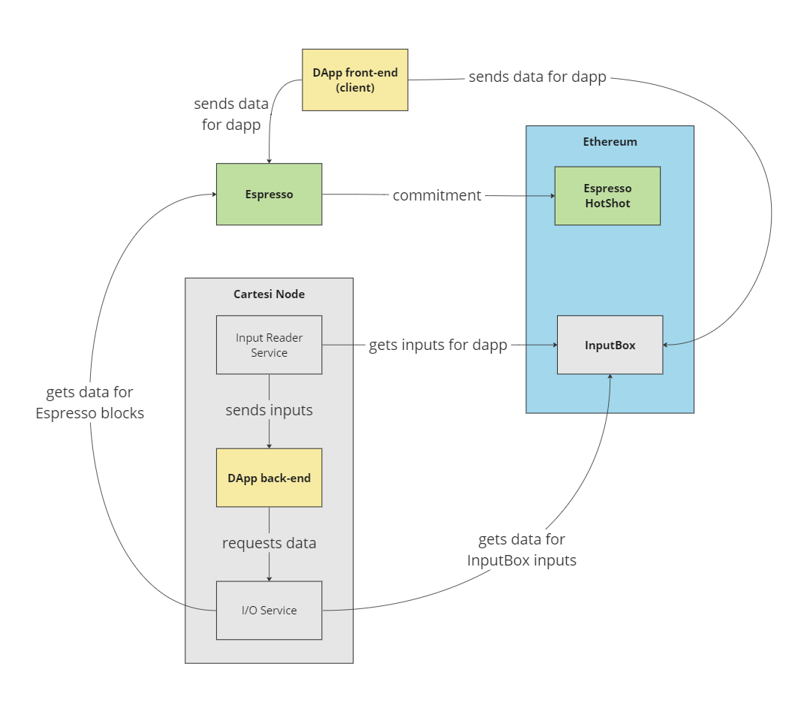

# rollups-espresso

Experimentation to allow the creation of Cartesi DApps using Espresso's sequencer and DA.

The first version of the experiment, using Espresso solely as DA, can be found [in this branch](https://github.com/miltonjonat/rollups-espresso/tree/release/0.1.x-da-only).

## Rationale

[Espresso Systems](https://www.espressosys.com/) provides a decentralized sequencer and data availability system, which can be of use to scale layer-2 rollup solutions.
[Cartesi](https://cartesi.io) provides a [rollups solution](https://docs.cartesi.io/cartesi-rollups/) which could particularly benefit from both.

In this experiment, we implement a simplified solution to allow Cartesi DApps to pull data from the Espresso sequencer while retaining the ability to fetch inputs from the Cartesi Rollups InputBox contract on the base layer (as they usually do).
As such, applications can take advantage of Espresso's higher throughput and lower fees and latency, while still being able to interact with the base layer (e.g., to manage L1 assets).

The main purpose of this experiment is to learn how this kind of integration could work in practice, while still being generally compatible with fraud proof systems such as Dave.
At its current stage, the experiment attempts to do minimal changes to the current Cartesi Rollups architecture, particularly by preserving how inputs and outputs are handled by the Cartesi Node (which is probably not the ideal approach for a production-ready implementation).

Please note that this experiment is currently **incomplete**, and can only be executed in "host mode". An actual implementation using Cartesi Machines will require a version of the Cartesi Node that is compatible with the machine's new generic I/O device.


## Architecture

The general procedure envisioned here is for the application to specify which data it should process next, instead of passively receiving inputs.
This is done by having the application make an "I/O request" specifying a `domain` of interest (e.g., "inputbox" or "espresso") and an `id` within that domain (e.g., an input index, or an Espresso block number).

### How I/O requests are made

In a real implementation, I/O requests would be sent to the Cartesi Machine's new generic I/O device, which would then yield (halt the machine). Outside the machine, the Cartesi Node would notice the request, fetch the corresponding piece of data, write the data to the machine, and then resume the machine's execution. The fetching of the data could be done via an "I/O service" component running in the Node, which would have drivers (or plugins) capable of fetching data for each supported domain.

For this experiment, since we do not have a Node compatible with the generic I/O device, we will run the application in "host mode" (i.e., directly on the host and not inside the Cartesi Machine), and have it call the I/O service component directly.

### Why this way? Considerations about fraud proof systems

This approach of having the application request the data, as opposed to passively receiving inputs, is crucial for the solution to remain manageable by a fraud proof system such as Dave. When there are several sources of data (as is the case here), it would become extremely complicated for an on-chain dispute resolution process to include the logic for handling the relative order of the data.

Instead, if that logic is contained within the application itself (i.e., in code running inside the deterministic Cartesi Machine), it becomes transparent to the fraud proof system.
The only requirement is that each I/O operation must be provable on-chain, meaning that it must be possible to prove the Cartesi merkle root hash of the data returned by the `[domain, id]` request. These proofs (which may even involve ZK for some cases) are not implemented in this experiment.
It is also naturally required that each request be fully deterministic, meaning that it must always yield the exact same data regardless of when it was called.

### General workflow

The following diagram summarizes the general workflow:



1. DApp is deployed to an Ethereum-compatible network, for which there is an `Espresso` instance submitting its commitments
1. `Client` submits a first input to the DApp via the L1 InputBox
1. The `Cartesi Node` reads the input from the `InputBox` and sends it to be processed by the `DApp back-end`, as with any other input
1. The `DApp back-end` starts up to process the input, and then begins requesting data from both the L1 `InputBox` and `Espresso`, via the `I/O Service`; whenever it requests data, it blocks (yields) until it receives it
1. `Client` submits subsequent data to the DApp: either via the L1 `InputBox` (higher latency and costs), or via `Espresso` (lower latency and costs); for `Espresso`, it will use a VM ID derived from the Cartesi DApp's address
1. The `I/O Service` fetches data from both sources, and serves them when requested by the `DApp back-end`
1. The `DApp back-end` receives the data and resumes processing

### I/O request ordering

To read data from both the L1 InputBox and Espresso, the DApp back-end must establish a well-defined and repeatable order.
In this experiment, this is accomplished by using L1 blocks as anchors to define when to switch from one source to the other. As such, in every I/O request of the form `[domain, id]`, the `id` includes an L1 block number of reference, meaning that the request should only return the corresponding data if it was found to be available at the time of that L1 block.

The basic workflow is as follows:
1. First InputBox input is received, which includes the L1 block number in which it was added
2. DApp back-end processes all other InputBox inputs that were added _in that same L1 block_
3. DApp back-end processes all data from Espresso blocks that were available _at the time of that same L1 block_
4. DApp back-end increments L1 block number of reference and returns to (2)

It should be noted that step (3) is possible because Espresso blocks include information about the state of the L1 chain at the time they are produced (e.g., the current L1 finalized block hash and number).

## Components

To implement the proposed architecture, this repository contains the following components:

- `dehashing-server`: a simple HTTP server that receives requests for InputBox inputs and Espresso blocks (and potentially other data sources), returning the corresponding data. This component is expected to run inside the Cartesi Node
- `echo-espresso`: a back-end that requests data from both the InputBox and Espresso in a well-defined order, and outputs a notice repeating ("echoing") each payload received

## Running

To run this experiment on Sepolia, perform the following steps:

1. Build the `echo-espresso` DApp with sunodo

```shell
cd echo-espresso
sunodo build
```

2. Deploy the `echo-espresso` DApp to Sepolia (e.g., using an Alchemy gateway)

```shell
export NETWORK=sepolia
export CHAIN_ID=11155111
export MNEMONIC=<user sequence of twelve words>
export RPC_URL=https://eth-sepolia.g.alchemy.com/v2/<USER_KEY>
export WSS_URL=wss://eth-sepolia.g.alchemy.com/v2/<USER_KEY>
docker compose -f deploy.yml run authority-deployer
docker compose -f deploy.yml run dapp-deployer
```

3. Start a local validator node without a back-end (aka run it in "host mode") for that deployment on Sepolia

First, define `SUNODO_BIN_PATH` by checking where Sunodo is installed in your system. For instance, if Sunodo was installed globally via npm, you can run `npm -g list` to find out its installation path, and then define the variable as such:

```shell
export SUNODO_BIN_PATH=~/.nvm/versions/node/<NODE_VERSION>/lib/node_modules/@sunodo/cli/dist
```

And then, start the node:

```shell
docker compose -f $SUNODO_BIN_PATH/node/docker-compose-validator.yaml -f $SUNODO_BIN_PATH/node/docker-compose-database.yaml -f $SUNODO_BIN_PATH/node/docker-compose-explorer.yaml -f $SUNODO_BIN_PATH/node/docker-compose-anvil.yaml  -f $SUNODO_BIN_PATH/node/docker-compose-proxy.yaml -f $SUNODO_BIN_PATH/node/docker-compose-prompt.yaml -f $SUNODO_BIN_PATH/node/docker-compose-host.yaml -f $SUNODO_BIN_PATH/node/docker-compose-envfile.yaml -f ./deployments-volume.yaml --project-directory . up --attach prompt --attach validator
```

4. In a separate terminal, start the `dehashing-server` for the deployed DApp and looking at Sepolia as the base layer (it will run on port 5006)

```shell
export RPC_URL=https://eth-sepolia.g.alchemy.com/v2/<USER_KEY>
export DAPP_ADDRESS=$(cat echo-espresso/.deployments/sepolia/dapp.json | jq -r .address)
cd dehashing-server
yarn && yarn start
```

5. In a separate terminal, run the `echo-espresso` back-end in the host

```shell
cd echo-espresso
yarn && yarn start
```

### Interacting with the application

1. First of all, extract the application's deployed address

```shell
cd echo-espresso
export DAPP_ADDRESS=$(cat .deployments/sepolia/dapp.json | jq -r .address)
```

2. Send an L1 input via the InputBox using `sunodo send`

```shell
sunodo send generic --dapp $DAPP_ADDRESS -c $CHAIN_ID -r $RPC_URL --mnemonic-passphrase "$MNEMONIC"
```

3. Send some arbitrary data to Espresso (we are using the Gibraltar testnet in this experiment). Note that we are currently deriving the DApp's VM ID from the first 8 bytes of the DApp's address:

```shell
export VM_ID=$(DAPP_ADDRESS_UPPER=${DAPP_ADDRESS^^} && echo "ibase=16; ${DAPP_ADDRESS_UPPER:2:16}" | bc)
curl -X POST -H "Content-Type: application/json" -d '{ "vm": '$VM_ID', "payload": [100, 110, 120, 130] }' https://query.gibraltar.aws.espresso.network/submit/submit
```

4. Check the corresponding output notice generated by the DApp back-end

```shell
curl http://localhost:8080/graphql -H 'Content-Type: application/json' -d '{"query":"{ notices { edges { node { payload } } } }"}'
```

## Current limitations and known issues

1. As noted before, for now this experiment only runs in host mode
1. Outputs are currently only updated in the GraphQL endpoint when an L1 InputBox input is processed
1. Data retrieval via the [dehashing-server](./dehashing-server/) is not optimized, so it's a good idea to update the `espressoBlockHeight` initial value in [echo-espresso](./echo-espresso/src/index.ts) to a current one
1. Epoch computation in the [dehashing-server](./dehashing-server/) does not currently comply with what the Authority consensus actually does
1. The [dehashing-server](./dehashing-server/) is currently reading L1 data from "latest" instead of "finalized", because the Node is not reading "finalized" at the moment
1. Back-end code should expect Espresso data to be signed and include a nonce; it should parse that to define `msgSender` and use the nonce to avoid processing duplicate payloads/transactions
